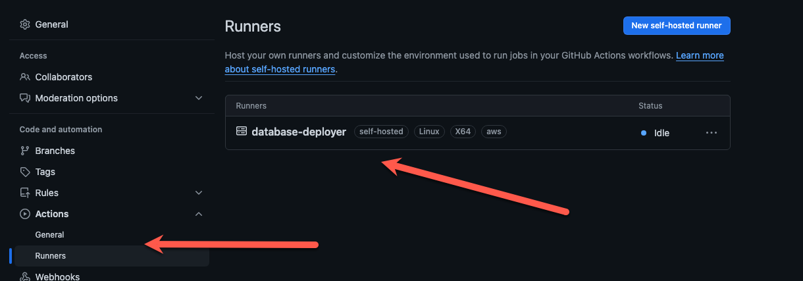
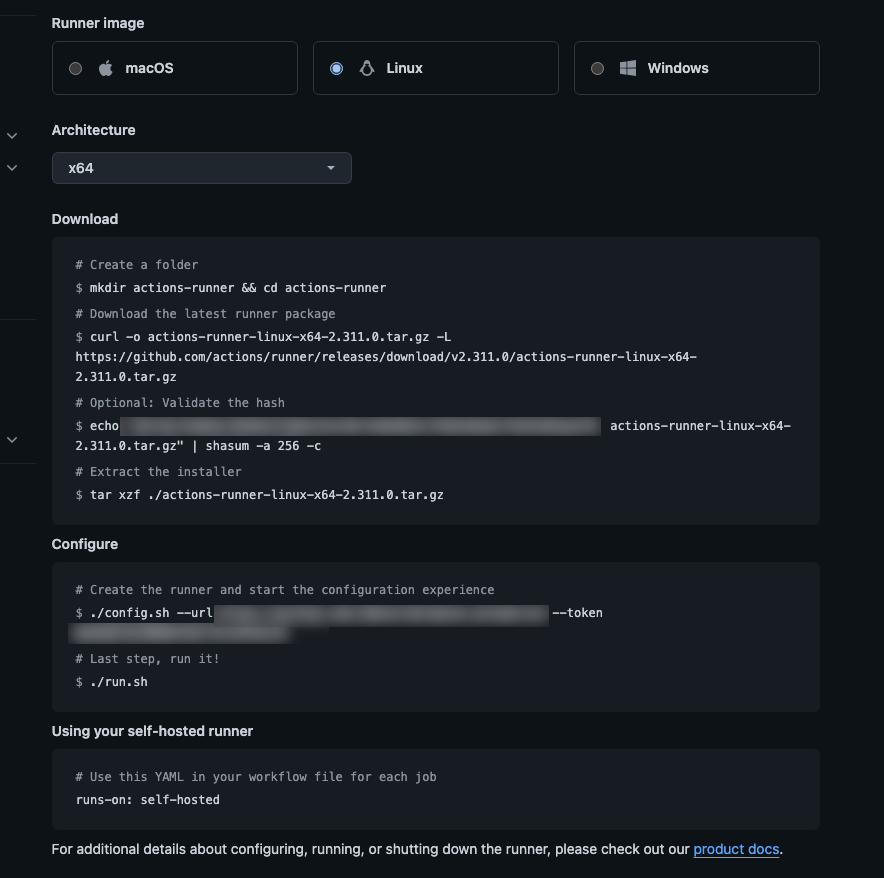

<style>
.primary { color:#C5CAE9 }
.accent { color:#FF4081 }
</style>

<h1 class="primary">Github Self-Hosted Runner</h1>

We are going to configure our bastion host to also be a [self-hosted github](https://docs.github.com/en/actions/hosting-your-own-runners/managing-self-hosted-runners/about-self-hosted-runners) runner so that we can deploy our database changes.
Setting up a self-hosted runner is pretty [straight forward](https://docs.github.com/en/actions/hosting-your-own-runners/managing-self-hosted-runners/adding-self-hosted-runners). 

1. From your repository, select the Settings tab at the top
2. On the left navigation, select Actions >> Runners 



4. Click "New Self-Hosted Runner"
5. Login to the bastion host and run the scripts displayed on the screen:



6. The last step is to configure the [runner as a service](https://docs.github.com/en/actions/hosting-your-own-runners/managing-self-hosted-runners/configuring-the-self-hosted-runner-application-as-a-service). 
    
```shell
sudo ./svc.sh install
sudo ./svc.sh start
sudo ./svc.sh status
```

[Home](../ReadMe.md)
