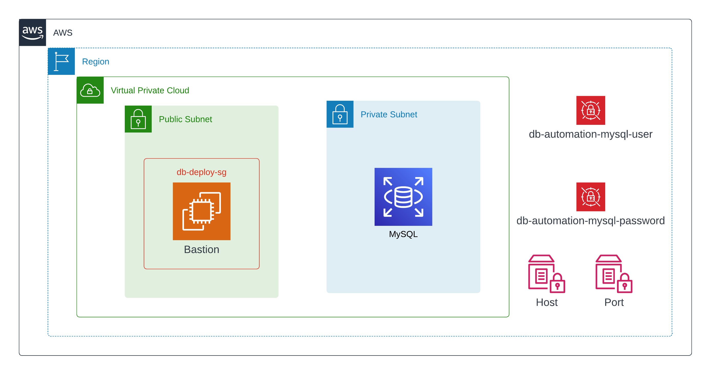

<style>
.primary { color:#C5CAE9 }
.accent { color:#FF4081 }
</style>


<h1 class="primary">Intro</h1>
Database automation (automating database deployments) is hard.  From a technology standpoint, databases are often the most 
protected resource in terms of security and access.  Organizations protect their data and databases (rightfully so) with 
zeal and in some cases to the point where it hinders progress.

A development organization needs to be able to move quickly so that new features and capabilities are introduced to their 
constituents and bring value.  Software development as a whole has made huge strides in this area with improvements in source 
control systems, CI/CD tools and changes in software delivery methodologies. 

Legacy systems often present the biggest challenges to automating database deployment because they were not engineered either 
from an architecture or a process perspective with automation in mind.  

This series will look into various tools and techniques that can be used to bring some automation to database deployments.  

<h1 class="primary">Caveats</h1>
This series is not intended to be authoritative on what **SHOULD** be done.  It is not meant to be **THE WAY** of doing this.  

Rather these tools, opinions and techniques represent **A WAY** of doing things.  

This is also not an exhaustive list - I am sure I will have left some out.  Maybe I'll eventually get to them.   Maybe someone 
else will jump in and add another tool.  There are lots of reasons (time being the biggest one) why a specific language or tool
will not be included here.

For starters - I am not a Java guy.  So for all you Java folks out there - if there is something in the Java ecosystem you want to 
see - by all means get a PR in.  


<h1 class="primary">Motivation and Evaluation Criteria</h1>
Any tool or process needs some criteria to measure against.  What we will find is that no single tool can handle all of these
ideal requirements.  I am sure this list is not exhaustive, but I feel captures the most important or asked for features 
when it comes to database automation in dev ops.  

<h3 class="accent">History of Changes</h3>
Any automation tool or process must include source control.  Source control gives us the ability to control who and when 
code changes, as well as history of when those changes were made and ideally why they were made.  

<h3 class="accent">Changes are Deployed with Application Code</h3>
I have seen many organizations were another team is responsible for applying database changes.  This becomes very problematic
when database changes are dependencies to changes to application code (more often than not the case).  In larger or fast moving
organizations, QA teams will often have their own environments and schedules as to when they will test features or work items.

So the scenario that unfolds (a lot) is a developer makes a database change (let us say adds a column to a table) 
and makes the changes to the application code accordingly.  The developer has access to the "dev" database but must coordinate
with another team to make the changes to the "QA" database.  The problem here is the developer is going to submit a PR, 
go through the code review process and once everything merged, move on to the next assignment.  

Who knows when the QA team will pick up the item to test.  When the QA team does get ready to test, they deploy required
code changes to their environment and start testing.  Immediately the application blows up because the required database changes
did not get deployed and the QA team marks the defect as still broken (or even more broken).  In really bad cases it turns into
a stop everything you are doing because we broke QA.  

Hours later the developer finds the problem as a missing column in the database as noted in the stack trace logs.  He / She
contacts the database team, coordinates to apply the change and the world is whole again.  

I have lost **YEARS** of my life in this scenario.  

Database changes must live with the application code.  The changes that made must be in the same commit as the application code.  

And finally the changes must be deployed at the same time the application code changes are deployed.  

<h3 class="accent">Ability to Add / Update Seed Data</h3>
You will often find scenarios where configuration or look-up data is maintained in a database.  Generally I prefer to keep this kind 
of data in configuration files or some other tool, but the scenario is still common enough that warrants a requirement to be able to
control this "data" in source control.  There are a lot of legacy applications out there that may NEVER get re-written because
they are doing the job just fine.  These applications may be one of those systems that keep configuration data in tables.  The use case
is not going away anytime soon and any tools we use should be able to handle this scenario.

```sql
UPDATE APP_CONFIG SET SettingValue='https://somedomain.com' WHERE SettingName=WebsiteUrl ;
```

Something like this could / should be kept in source control.  1. We get the history as noted above and 2. It will be consistently 
applied at deployment for every environment.  

<h3 class="accent">Apply Changes Without Data Loss</h3>
This can almost go without saying, but as we will see some tools cannot meet this requirement (without help).  This scenario 
occurs when we make a change to database schema that would cause data loss (i.e. if I change the length of a VARCHAR column 100 -> 50) it 
will truncate.  Or if you change data types of a column.  

If the tool cannot handle this, then we must augment the tool with an out-of-band process (i.e. manual intervention).

<h3 class="accent">Local Development Support</h3>
When an organization has teams of developers, it is imperative that when changes are made to the underlying database those changes
are distributed to every developer running locally.  

The most obvious solution is keep the database under source control.  The tool needs to be able to run locally so developers
can apply those changes to their local copies.

<h3 class="accent">Completely Automated</h3>
The tool should be able to work without human help.  This does not mean without human approval - we can still have a step 
that requires a person to say "yes" or "no" to the deployment.  However once that deployment is approved it happens without
help.  

<h3 class="accent">Language Agnostic</h3>
There are tools out there that written in the developers language of choice.  This is handy for developers but can be a problem
when other people need to make database changes.  The tool should support SQL so all technical personnel can make changes to 
the database. 

<h3 class="accent">Rollback</h3>
We need to be able to back-out a deployment.  In the case of an application deployment, this is typically just re-deploying the 
previous build.  

Databases are different problem in that restoring the state the database to what it looked like prior to a deployment may not be
straightforward (seldom is).  A tool that allows us to revert a deployment with a click similar to the way application code is 
reverted is the ideal tool.

<h3 class="accent">Scaffold from Existing</h3>
Just because a database is not currently under source control and automation does not mean it cannot be.  Any tool or tools we 
use should be able to scaffold our database model (the files we keep under source control) from an existing database.  

<h1 class="primary">Overview</h1>
We are going to deploy a stack to AWS that allows us to simulate a real world environment.  Our stack consists of a VPC, 
subnets, an EC2 that will act as a bastion host / application host / deployment job runner, an RDS database and finally 
some secrets and systems manager parameter to store our database connection information. 



The EC2 instance is deployed to a public subnet (allowing us to connect to the server).  The RDS instance is deployed into 
a private isolated subnet.  We add a security group with a rule to allow for communication between the EC2 instance and
the RDS instance.  

Our EC2 instance will also service as a bastion host and Github Action runner.  We will be able to run mysql client commands
via the commandline as well as deploy our database changes because of the security group and network configuration we set-up in the 
stack.  

<h1 class="primary">Table of Contents</h1>

I will be adding more sections over time.  The stack deployment will also be modified over time (adding in additional resources).  

Our starting point will be with the stack deployment.  Once the stack is deployed and verified, we then configure the bastion host 
to also act as a Self-Hosted runner in Github Actions.  

Step 3 is the first tool evaluation.  I will be adding more sections over time.  

1. [Stack Deployment](stack/Stack-Deployment.md)
2. [Github Runner](.github/Runner.md)
3. [Skeema](skeema/Skeema.md)
