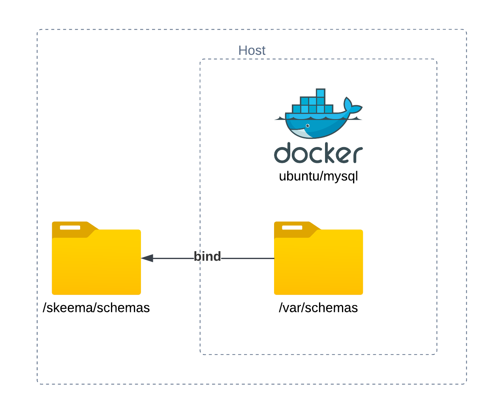
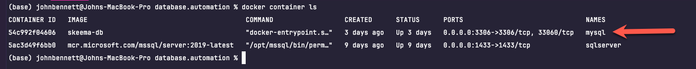
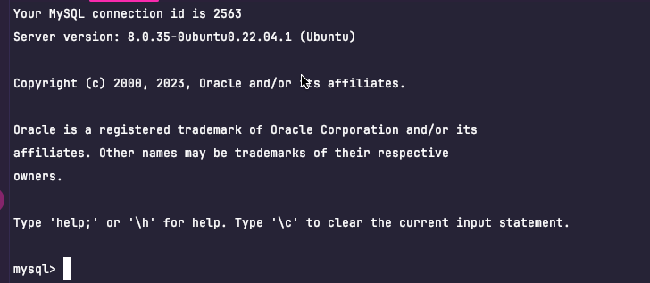
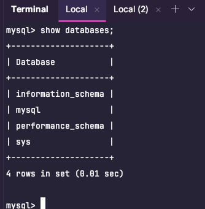
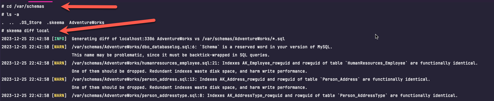
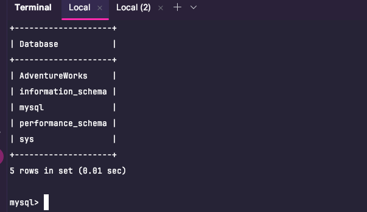
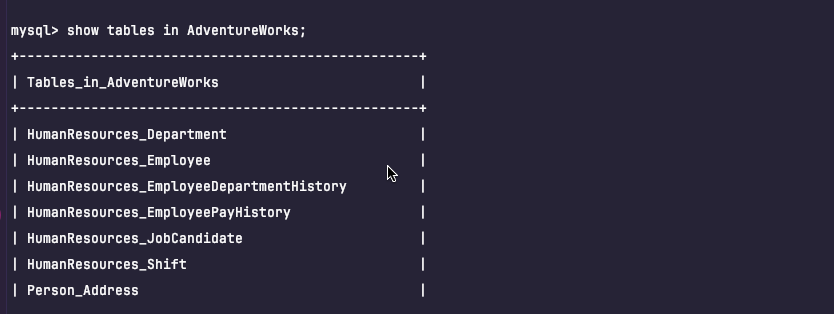

### [Skeema](https://skeema.io)

Skeema is a state based database management tool for MySql databases.  You define the state you want your database to be in
through a series of create statements that represent your database objects; the tool then compares your model state to the 
target database state and applies the changes.

This approach works well for source control and situations where the database can be destroyed and re-created
(such as early development).

The problem with this type of approach is that it takes a brute force approach to migrating - regardless of data loss or not.  


#### Version

There are 3 versions of the skeema cli available.  

- community
- plus
- max

Unfortunately the community (free) version is only supported on Linux and MacOS machines.  You would need to purchase
Plus or Max to get access to the Windows build.  

The community version also does not support views, triggers or seeding data.  

For the purpose of this demonstration the community edition will serve what we need to demonstrate.

We are going to use Docker to get around the platform limitations.  

##### Docker

The way we can get around the limitation of Linux or Mac for the community edition is to build our own docker image with the 
skeema cli installed.  

We can use the bind mount feature of docker to bind a host directory to a directory running in the container. 



What we will do is maintain our database definition in the [schemas](../skeema/schemas) directory which then used as a bind
mount in the running container.  

Our first step is to define a [dockerfile](dockerfile) which will contain the mysql instance and the skeema cli.

```dockerfile
FROM ubuntu/mysql
RUN apt-get update
RUN apt-get -y install curl
RUN curl -LO https://github.com/skeema/skeema/releases/latest/download/skeema_arm64.deb
RUN apt install ./skeema_arm64.deb
```

Not a lot of magic here.  Our image is based on the ubuntu/mysql image.  We then use the same instructions we used 
to install the skeema cli on our bastion host

To make our lives a bit easier, we use [Docker Compose](docker-compose.yml) to stand up and tear down the container.  

```yaml
version: '3.1'

services:

  db:
    container_name: mysql
    build: .
    ports:
      - '3306:3306'
    environment:
      MYSQL_ROOT_PASSWORD: password
    volumes:
      - ./schemas:/var/schemas
```

Docker compose will build an image called "skeema-db".  A bind volume mount is declared binding the [schemas](schemas) 
directory to the /var/schemas directory of the container. 

Start the container.

```shell
docker-compose up -d
```

Then check the container status

```shell
docker container ls
```



Run a shell script against the container. 

```shell
docker exec -it mysql sh
```

At the bash prompt - login to the local MySql instance:

```shell
mysql -h localhost -r user -ppassword
```



List the databases.

```shell
mysql>show databases;
```



##### Adventure Works

I found a MySql version of the time honored [Adventure Works](schemas/AdventureWorks) database.  So we are going to deploy 
a fresh copy of the Adventure Works schema to our running mysql container. Before we go into the commands in the script, 
I want to briefly describe how the skeema cli works.  

The first thing to point out is the configuration file [.skeema](schemas/.skeema).

```text
generator=skeema:1.11.0-community

[deploy]
flavor=mysql:8.0
host=#{DB_HOST}#
password=#{DB_PASSWORD}#
port=#{DB_PORT}#
user=#{DB_USER}#

[local]
flavor=mysql:8.0
host=localhost
password=password
port=3306
user=root
```

This file defines 2 profiles:  deploy and local.  

For now we focus on the local profile.  The configuration is pretty obvious.  It defines the version of mysql, the host, 
credentials and the port that the skeema cli will use to access the database. 

The commands we are interested in are the [diff](https://www.skeema.io/docs/commands/diff/) and [push](https://www.skeema.io/docs/commands/push/) commands.

The diff command does exactly what it sounds like - it captures the diff between the model and the instance.

Once again run an interactive shell against the mysql container:

```shell
docker exec -it mysql sh
```

Once you have a shell container running, change directories to the container bind mound directory: 

```shell
cd /var/schemas
```

Run the diff command for the local profile:

```shell
skeema diff local
```


Every difference between the model and instance are identified. 

Push the changes to the instance.  

```shell
skeema push local --allow-unsafe
```

Connect to the database - let's confirm the deployment.

```shell
mysql -h localhost -u root -ppassword
```

List the databases:

```shell
mysql>show databases;
```



Finally, list the tables in the AdventureWorks database:

```shell
mysql>show tables in AdventureWorks;
```


Logging in to the container and running the diff and update commands is tedious.  So I have provided a few helper scripts. 

[update-database.sh](update-database.sh) and [skeema.sh](skeema.sh).

Now all we need to do to apply changes is:

```shell
sh update-databash.sh
```

After running this we se no differences:

```text
(base) johnbennett@Johns-MacBook-Pro skeema % sh update-database.sh 
2023-12-25 23:11:04 [INFO]  Generating diff of localhost:3306 AdventureWorks vs /var/schemas/AdventureWorks/*.sql
2023-12-25 23:11:04 [INFO]  localhost:3306 AdventureWorks: No differences found
2023-12-25 23:11:04 [INFO]  Pushing changes from /var/schemas/AdventureWorks/*.sql to localhost:3306 AdventureWorks
2023-12-25 23:11:04 [INFO]  localhost:3306 AdventureWorks: No differences found
```

##### Getting Updates from Source and Applying

I have applied a change to the model - adding a "TestTable" to the schema - from a different machine.  In typical workflow we 
will pull the latest from source and create a new branch to work with.  

This time we will make sure our local copy of the database is sync'd up. 
