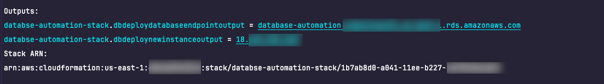
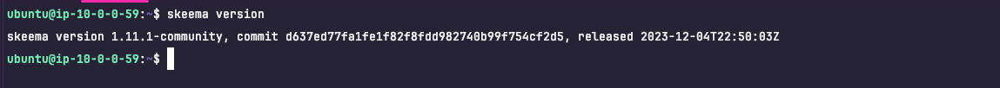
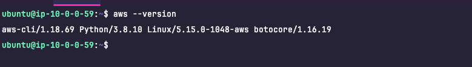
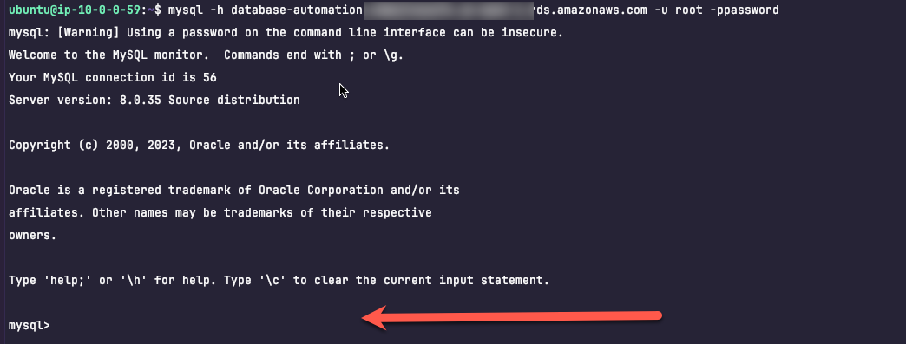
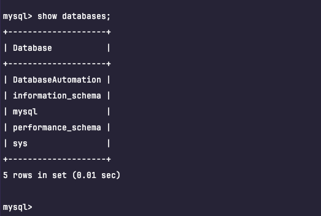

### Stack Deployment

I am using the AWS CDK as my weapon of choice for the IAC problem.  Let's walk through each portion of the stack to get 
an understanding of how this will accomplish the task. 

### Create SSH Key

In the AWS console, you will need to [create an ssh key](https://docs.aws.amazon.com/AWSEC2/latest/UserGuide/ec2-key-pairs.html) to allow for access to the host. I have created a key ***jbennett*** 
by importing my public id_rsa.pub signature into the console.


The second thing we need to do is install the dotenv package so we can use local .env files to store environment variables.

```json
  "dependencies": {
    "aws-cdk-lib": "2.106.1",
    "constructs": "^10.0.0",
    "dotenv": "^16.3.1",
    "source-map-support": "^0.5.21",
    "typescript-string-operations": "^1.5.0"
  }
```

```shell
yarn add dotenv
```

Next add a .env file to the root of the [stack](../stack) directory.  This file should contain set the following environment 
variables. 

```dotenv
AWS_REGION={your region}
dbUser=root
dbPassword=password
keyName={your ssh key name}
```

I am deploying this to us-east-1 and my keyName is ***jbennett***.  Obviously the dbUser and dbPassword are the secure - 
but this was kept simple for the purposes of illustration.  

### Stack Explanation

Referencing the [stack.ts](lib/stack.ts) file the first thing we do is initialize the environment variables the stack will use 
from our .env file.  


```ts
require('dotenv').config();

const config = {
  env: {
    region: process.env['AWS_REGION'],
    dbUser: process.env['dbUser'],
    dbPassword: process.env['dbPassword'],
    keyName: process.env['keyName'],
  }
}
```

Next we set some local variables that will be used in the stack and define the VPC and subnets.

```ts
const user = config.env.dbUser!;
const password = config.env.dbPassword!;
const keyName = config.env.keyName;

const vpc = new ec2.Vpc(this, 'database-vpc-', {
  subnetConfiguration: [
    {
      cidrMask: 24,
      name: 'db-deploy-subnet',
      subnetType: SubnetType.PUBLIC,
    },
    {
      cidrMask: 28,
      name: 'database-subnet',
      subnetType: ec2.SubnetType.PRIVATE_ISOLATED
    }
  ]
});
```

We need to allow internet traffic in and out to our bastion host as well as open port 22 so we can ssh into the box.  

```ts
const securityGroup = new ec2.SecurityGroup(this, 'db-deploy-instance-sg', {
    vpc: vpc,
    allowAllOutbound: true,
    securityGroupName: 'db-deploy-sg'
  }
)

securityGroup.addIngressRule(
  ec2.Peer.anyIpv4(),
  ec2.Port.tcp(22)
)

```

We define our RDS instance.  

```ts
  const databaseInstance = new DatabaseInstance(this, 'mysql-instance', {
      vpcSubnets: {
        onePerAz: true,
        subnetType: ec2.SubnetType.PRIVATE_ISOLATED
      },
      instanceIdentifier: 'database-automation',
      vpc: vpc,
      databaseName: 'DatabaseAutomation',
      allocatedStorage: 20,
      port: 3306,
      engine: DatabaseInstanceEngine.mysql({
        version: MysqlEngineVersion.VER_8_0
      }),
      instanceType: ec2.InstanceType.of(ec2.InstanceClass.T3, ec2.InstanceSize.MICRO),
      credentials: Credentials.fromPassword(user, new SecretValue(password)),
      caCertificate: CaCertificate.RDS_CA_RDS2048_G1,
});
```
Next up we define the bastion host.  A few things going here.  For starters, we define a role for the EC2 instance to 
assume.  This is done because not only will the bastion host serve as a means to run mysql client commands to our RDS instance, 
but it will also serve as a Github Action runner which we will define later.  

The role and corresponding EC2 Instance Profile
will allow the AWS cli commands to be executed without specifying user access keys or secrete keys in Github; an AWS best 
practice when it comes to security.

```ts
const role = new iam.Role(this, 'ec2-role', {
  roleName: 'db-deploy-role',
  assumedBy: new iam.ServicePrincipal('ec2.amazonaws.com')
});
```

Next up is the instance and adding user data so that the tools we need are installed when the instance is created.  

```ts
const instance = new ec2.Instance(this, 'db-deploy-instance-new', {
  vpc: vpc,
  role: role,
  securityGroup: securityGroup,
  vpcSubnets: {
    subnetType: ec2.SubnetType.PUBLIC
  },
  instanceName: 'db-deploy-instance',
  instanceType: ec2.InstanceType.of(ec2.InstanceClass.T3, ec2.InstanceSize.MICRO),
  machineImage: ec2.MachineImage.genericLinux(
    {'us-east-1': 'ami-06aa3f7caf3a30282',
      'us-east-2': 'ami-05fb0b8c1424f266b'}),
  keyName: keyName,
  userDataCausesReplacement: true
});

instance.addUserData(
  readFileSync('./lib/user-data.sh', 'utf8')
);
```

Examining the [user-data.sh](lib/user-data.sh), what we are doing here is downloading the skeema cli and installing it 
using a debian package manager. 

The last step installs the awscli and the mysql client package so we can run sql commands using the cli from the bastion host.

```bash
#!/bin/bash

sudo apt update
curl -LO https://github.com/skeema/skeema/releases/latest/download/skeema_amd64.deb
sudo apt install ./skeema_amd64.deb
sudo apt install -y awscli mysql-client-core-8.0
```

This line creates a security group rule that allows the EC2 instance to communicate with the RDS instance.

```ts
databaseInstance.connections.allowFrom(instance, ec2.Port.tcp(3306));
``` 

The next section defines the SSM parameters and Secrets we will use to hold our database connection information. 

```ts
const hostParam =new cdk.aws_ssm.StringParameter(this, 'db-host-param', {
  parameterName: 'db-automation-mysql-host',
  stringValue: databaseInstance.dbInstanceEndpointAddress
});

const portParam = new cdk.aws_ssm.StringParameter(this, 'db-port-param', {
  parameterName: 'db-automation-mysql-port',
  stringValue: '3306'
});

const userSecret = new Secret(this, 'db-user-secret', {
  secretName: 'db-automation-mysql-user',
  secretStringValue: SecretValue.unsafePlainText(user)
});

const passwordSecret = new Secret(this, 'db-password-secret', {
  secretName: 'db-automation-mysql-password',
  secretStringValue: SecretValue.unsafePlainText(password)
});
```

We then grant read permissions to our EC2 Instance Profile role to read the parameters and secrets.  

```ts
hostParam.grantRead(role);
portParam.grantRead(role);
userSecret.grantRead(role);
passwordSecret.grantRead(role);
```

Finally, the IP address of the EC2 instance and RDS endpoint are configured as output parameters.  

```ts
new cdk.CfnOutput(this, 'db-deploy-new-instance-output', {
  value: instance.instancePublicIp
});

new cdk.CfnOutput(this, 'db-deploy-database-endpoint-output', {
  value: databaseInstance.dbInstanceEndpointAddress
});
```

From the stack directory, open a shell and run:

```bash
cdk deploy --profile {your profile}
```

If you want to use your default aws credentials - you can omit the 

```shell
--profile {your profile}
```


**Note**
If you have NEVER run CDK in this AWS account before, you will need to "bootstrap" CDK.  This can be done by running:

```shell
cdk bootstrap --profile {your profile}
```

Once the stack is deployed you should see the output parameters in the console.  




### Verify the Set-Up

Connect to the box over ssh

```shell
ssh ubuntu@{your ip}
```

First make sure skeema is installed.

```shell
skeema version
```



Next check confirm the aws cli.

```shell
aws --version
```



And finally make sure we can connect to the RDS instance from the bastion host.

```shell
mysql -h {database instance connection from the stack output} -u root -ppassword
```



If the connection is successful - you will get the mysql client prompt.

```shell
mysql>
```



Let's see all of our databases on the instance.

```shell
mysql>show databases;
```

The stack is now ready (almost).

[Home](../README.md)
